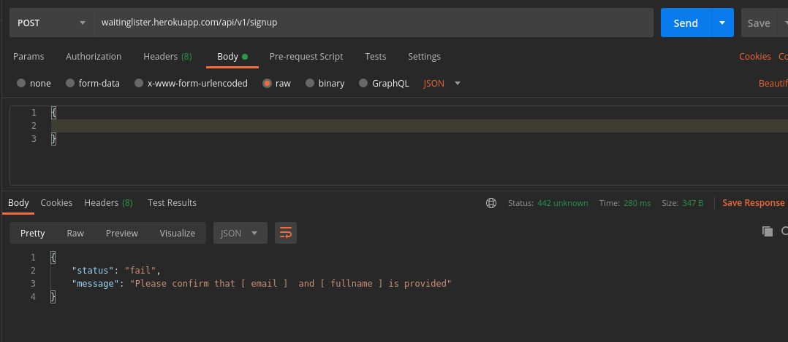
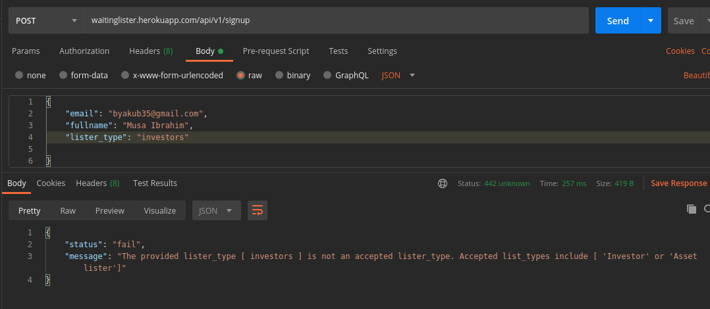
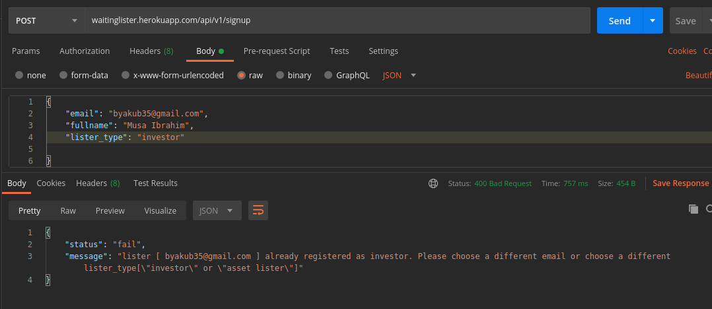
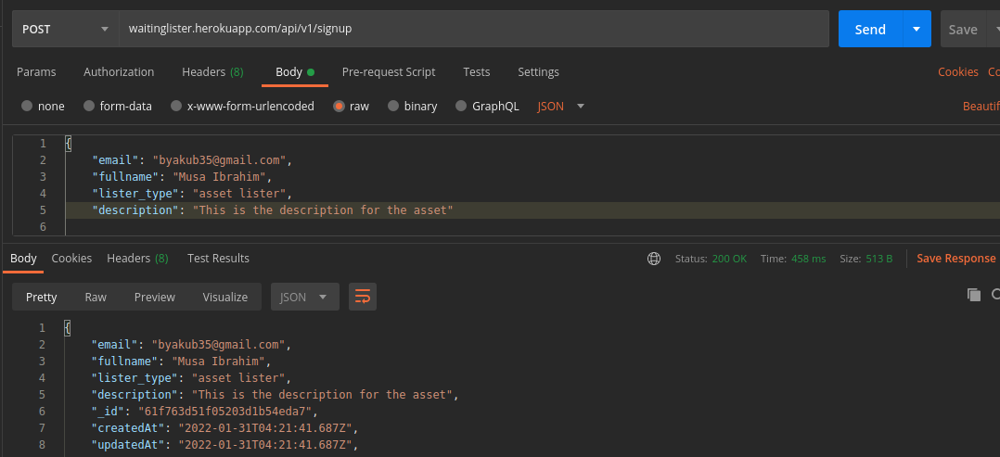
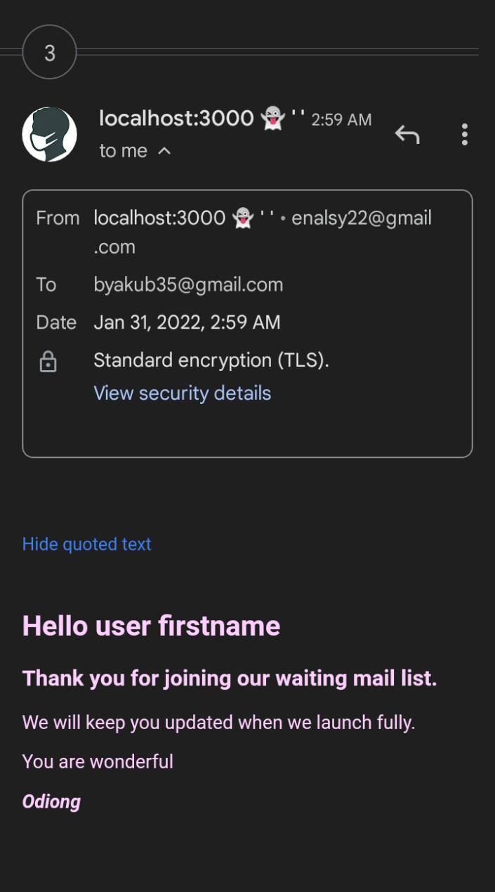

# WaitLister API

<br />
<p align="center">
  <a https://www.ennovatelab.com/">
    
  </a>
</p>
This API built with Nodejs helps people to join a waitlist. The waitlist is able to accomodate this listed types of users ;

- Investors
- Asset listers

The API accepts from both waitlister types their details as listed below;

- Ful name 
- Unique Email 

Additional requirement for Asset listers include a description of asset to be listed


### Built With

- [Nodejs](https://nodejs.org/en/)
- [Expressjs](https://expressjs.com)
- [Pino](https://getpino.io/)
- [Nodemailer](https://nodemailer.com)
- [Sendgrid](https://sendgrid.com)
- [Mongodb](https://sendgrid.com)
 
<!-- GETTING STARTED -->

## Getting Started

To get started setting up this project locally. Please kindly follow this steps to get a local copy up and running on your machine.

### Prerequisites

This are list of things you need to need to get installed.

- npm
  ```sh
  npm install npm@latest -g
  ```

### Installation

1. Fork the repo
   ```sh
   git clone https://github.com/udofia2/waitinglister.git
   ```
2. Install NPM packages
   ```sh
   npm install
   ```

3. To start development server
   ```sh
   npm run dev
   ```


## Usage

This project can be tested using postman, insomnia etc.
There is only one available API endpoint
* /signup (Registers a waitlister and sends them a notification on the provided email during registration.)


N/B: there are two types of waitlisters; Investors and Asset listers. You can not use the same email to register twice as the same waitlister. However, You can use the same email to register as an investor and also an Asset lister because this two waitlisters are of different types.


_For more examples, please refer to the [Documentation](https://documenter.getpostman.com/view/7592361/UVeCRUBH)

## Contributing

Contributions are what make the open source community such an amazing place to be learn, inspire, and create. Any contributions you make are **greatly appreciated**.

1. Fork the Project
2. Create your Feature Branch (`git checkout -b feature/AmazingFeature`)
3. Commit your Changes (`git commit -m 'Added some AmazingFeature'`)
4. Push to the Branch (`git push origin feature/AmazingFeature`)
5. Open a Pull Request


## License

Distributed under the MIT License. See `LICENSE` for more information.


## Contact

UDOFIA ABASIODONG - Portfolio: [Odiong](https://udofia.herokuapp.com) - [udofia Portfolio](https://udofia.herokuapp.com)

Project Link: [https://github.com/udofia2/waitinglister](https://github.com/udofia2/waitinglister)

Documentation: [Documentation](https://documenter.getpostman.com/view/7592361/UVeCRUBH)


## ScreenShoots





                                                                                                                                
